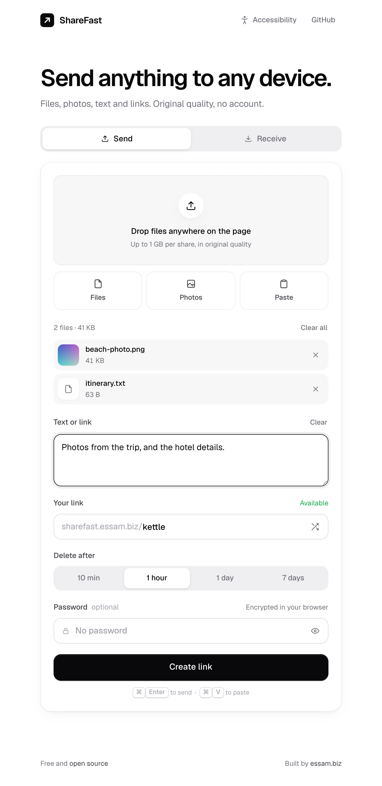
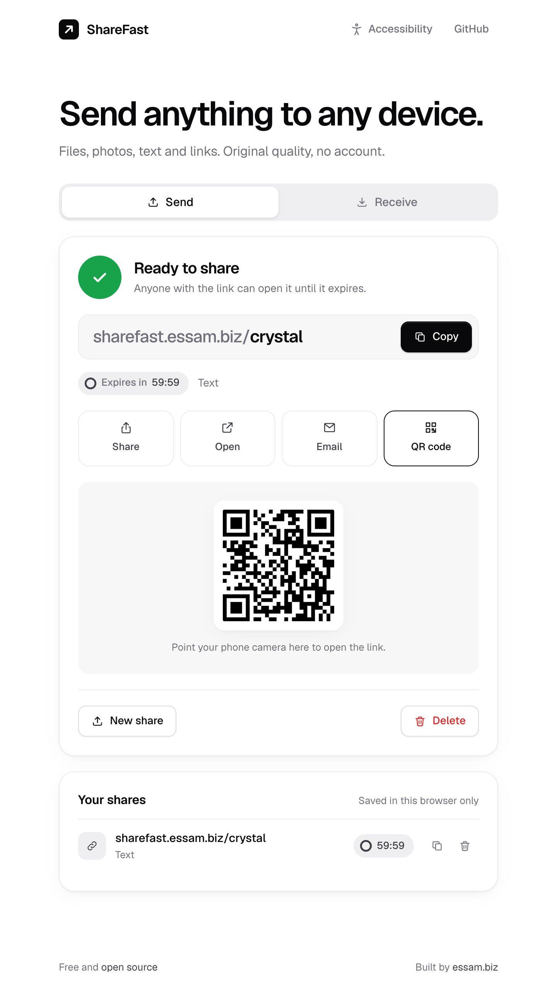
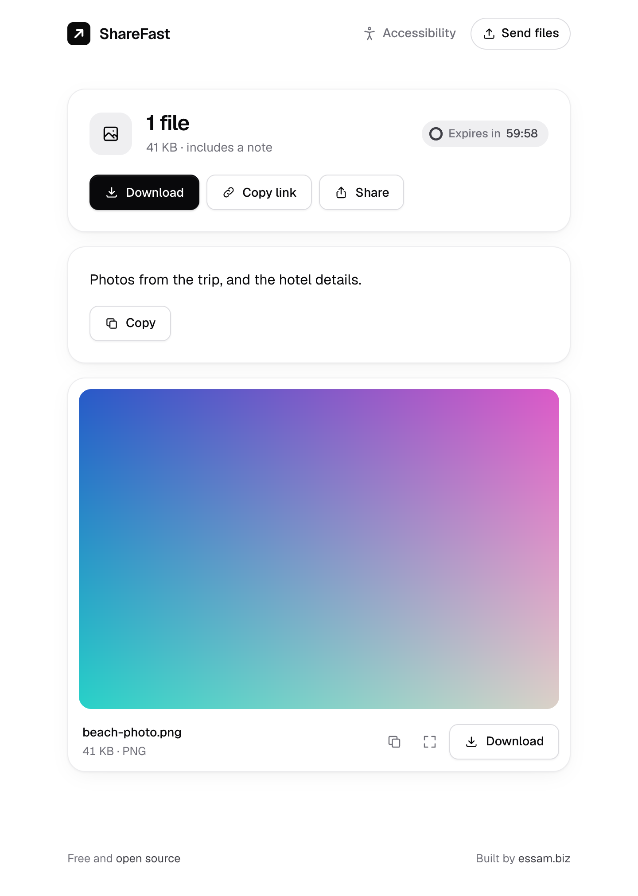

<p align="center">
  
</p>

<h1 align="center">ShareFast</h1>

<p align="center">
  Send files, photos, text and links between any two devices with a one-word link.<br>
  Free, open source, and no account needed.
</p>

<p align="center">
  <a href="https://sharefast.essam.biz"><strong>Open ShareFast</strong></a>
  &nbsp;·&nbsp;
  <a href="#running-locally">Run it yourself</a>
  &nbsp;·&nbsp;
  <a href="https://github.com/i3sam/ShareFast/issues">Report a bug</a>
  &nbsp;·&nbsp;
  <a href="https://essam.biz">Built by essam.biz</a>
</p>

<p align="center">
  <a href="LICENSE"></a>
  
  
  
</p>

<p align="center">
  
  
  
</p>

Open the site, drop something in, and you get a link like `sharefast.essam.biz/otter`. Open it on your other device and download. There's no account and no app to install, and everything is deleted when the link expires.

It's built for the everyday case of moving a photo from an iPhone to a Windows laptop, or a document from a work computer to your phone, without emailing it to yourself.

## Features

- **Any file, original quality.** Files are stored byte for byte. Nothing is compressed, resized or converted.
- **Text and links.** Paste a note or a URL and copy it or open it on the other side.
- **One-word links.** A free word is suggested before you send, so you know the link up front. Shuffle for another or type your own.
- **Expiry with a live countdown.** Pick 10 minutes, 1 hour, 1 day or 7 days. Both sides see the time left, and expired shares are deleted.
- **Password protection.** With a password, files, names and text are encrypted in your browser before upload. The server never sees any of them.
- **Made for phones.** Camera and photo library buttons, Save to Photos through the share sheet, 44px tap targets, and the screen stays awake during uploads.
- **Quick sharing.** Copy, share, open, email or show a QR code for the link. Paste straight from the clipboard, or drag files anywhere on the page.
- **Accessible.** Larger text, high contrast, reduced motion and underlined links, saved per browser. Full keyboard support and screen reader labels throughout.
- **Your shares.** Links you create are remembered in your browser only, so you can copy or delete them later.

## Running locally

Requires Node.js 22 or newer.

```sh
git clone https://github.com/i3sam/ShareFast.git
cd ShareFast
npm install
npm run dev
```

Open http://localhost:3000. Locally, files are kept in `./data` on your disk, so no accounts are needed. To try it from your phone on the same Wi-Fi, use your computer's local IP address, for example `http://192.168.1.20:3000`.

Clipboard access and password encryption only work on secure origins. `localhost` counts as secure, a LAN IP over plain `http` does not, so those two features need HTTPS when testing from another device.

Run the tests with `npm test`.

## Configuration

Settings are read from environment variables.

| Variable | Default | Description |
| --- | --- | --- |
| `MAX_SHARE_MB` | `1024` (`250` on Vercel) | Maximum size of one share |
| `MAX_STORAGE_MB` | `20480` (`900` on Vercel) | Total space all shares may use |
| `MAX_FILES` | `50` | Maximum files per share |
| `CRON_SECRET` | | When set, only Vercel Cron can trigger the cleanup job |
| `PORT` | `3000` | Port to listen on (self-hosted) |
| `HOST` | `0.0.0.0` | Interface to bind to (self-hosted) |
| `DATA_DIR` | `./data` | Where files are kept until they expire (self-hosted) |
| `TRUST_PROXY` | `false` | Set to `true` behind a reverse proxy so rate limits see the real client IP (always on for Vercel) |

The Vercel defaults fit the free Blob tier, which holds 1 GB in total. Raise them if your plan allows.

## Deploying to Vercel

This is how [sharefast.essam.biz](https://sharefast.essam.biz) runs. Files go to Vercel Blob and share details to Upstash Redis, both of which have free tiers.

1. **Import the repo.** In Vercel, choose **Add New → Project** and import this repository. Keep the default settings; `vercel.json` already sets everything up.
2. **Add Blob storage.** In the project, open **Storage → Create → Blob**, choose **Public** access, and connect it to the project. This adds `BLOB_STORE_ID` (or `BLOB_READ_WRITE_TOKEN` on older stores).
3. **Add Redis.** In **Storage → Create**, pick **Upstash for Redis** from the Marketplace and connect it to the project. This adds the `KV_REST_API_URL` and `KV_REST_API_TOKEN` variables.
4. **Redeploy** so the new variables are picked up (**Deployments → ⋯ → Redeploy**).
5. **Add your domain** under **Settings → Domains**, for example `sharefast.yourdomain.com`.

Until storage is connected, the site shows a message saying what's missing.

A daily [Vercel Cron](https://vercel.com/docs/cron-jobs) job removes expired files. Expired shares stop opening the moment they expire, and a few are also cleared out every time someone creates a share.

To develop against the real services locally, pull the variables into `.env.local` with `vercel env pull` and run `npm run dev`.

## Self-hosting

Without the Vercel variables, ShareFast stores files on local disk. That needs a server or container with a persistent volume (a VPS, Fly.io, Railway and so on). Run a single instance.

With Docker:

```sh
docker build -t sharefast .
docker run -d -p 3000:3000 -e TRUST_PROXY=true -v sharefast-data:/app/data sharefast
```

Then put HTTPS in front of it. With [Caddy](https://caddyserver.com), this is the whole config, and it gets a certificate automatically:

```
sharefast.essam.biz {
  reverse_proxy localhost:3000
}
```

If you use nginx instead, raise `client_max_body_size` above `MAX_SHARE_MB` and set `proxy_request_buffering off` so large uploads stream straight through.

Links and QR codes use whatever domain the site is served from, so there is nothing to configure for a custom domain.

## How it works

The server is plain Node.js with no framework. The frontend is HTML, CSS and JavaScript modules with no build step. The typeface is [Geist](https://vercel.com/font), self-hosted under the SIL Open Font License.

1. The browser asks the server to create a share and gets back the link, a private owner token, and where to upload each file.
2. Each file is uploaded. On Vercel it goes straight from the browser to Blob storage through a presigned URL that can only write that one file, at its announced size, within the hour. Self-hosted, it's streamed to the server's disk.
3. The browser confirms each upload, and the server checks the stored file matches the announced size.
4. The share opens once every file is in. Anyone who opens the link early sees upload progress.
5. Expired shares are cleaned up in the background.

The API is the same either way. `server/backends/` has one implementation for Vercel (Blob and Redis) and one for local disk.

### Encryption

Password-protected shares use the Web Crypto API.

- The key is derived with PBKDF2-SHA256 (600,000 iterations, random 16-byte salt) and used for AES-256-GCM.
- File names, types and text go into an encrypted manifest.
- Files are encrypted in 1 MiB chunks, each with its own IV, so large files never need to sit in memory as one buffer.

The server stores only ciphertext, the salt and the IVs. A wrong password fails GCM authentication, so the page can say so right away.

### Security notes

- One-word links are easy to type, which also makes them easy to guess. Looking up links that don't exist is tightly rate limited per IP, but that only slows guessing down. Use a password for anything private and send it separately from the link.
- Uploaded files are served as downloads by default. Only common image, video and audio types are shown inline as previews, never HTML or SVG. On Vercel, files are served from Blob's own domain, and each share's files sit under a random 32-character folder name.
- Every page has a strict Content Security Policy with no inline scripts. The only outside hosts it allows are Vercel's Blob storage endpoints.

### iPhone photos

Safari can convert HEIC photos to JPEG when they're picked from the photo library. To send the untouched original, choose the photo through the Files app, or set Settings > Photos > Transfer to Mac or PC to Keep Originals.

## Project layout

```
api/index.js        Vercel Function entry point
server/
  index.js          local and self-hosted server
  app.js            request handling, security headers, errors
  api.js            API routes
  backends/         storage: vercel.js (Blob + Redis) and disk.js
  validate.js       request validation
  static.js         pages and assets when self-hosted
public/
  index.html        send page
  share.html        receive page
  assets/app.css    all styles
  assets/js/        browser modules: send, receive, crypto, countdown, settings
test/               node:test suites
vercel.json         routes, headers and the daily cleanup job
```

## Open source

ShareFast is free and open source under the [MIT license](LICENSE). Use it, fork it, host your own copy, or build something new on top of it.

Contributions are welcome. Open an [issue](https://github.com/i3sam/ShareFast/issues) for bugs and ideas, or send a pull request. Please run `npm test` before submitting.

## Author

ShareFast is designed and built by **Essam**. See more of my work at **[essam.biz](https://essam.biz)**.
